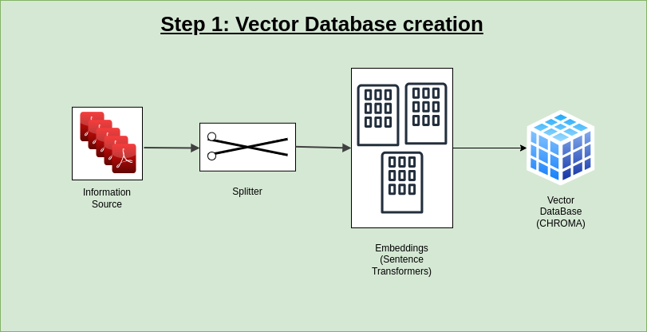

# 
Local LLM chatbot

# DEMO

## Models used:

> TinyLlama1.1b ==> 5 min to respond

> MBZUAI/LaMini-Cerebras-1.3B ==> 5 min

> MBZUAI/LaMini-GPT-1.5B ==> 2.5 min on average

- finalized third model due to performance and speed of response.

## Test results

- Note
  - The chatbot is enabled with memory using SQLite3 database with Django to develop both frontend and backend.

## Libraries used

- django
- python-dotenv
- langchain
- PyPDF2
- faiss-cpu
- sentence_transformers
- InstructorEmbedding
- chromadb
- tiktoken
- torch
- accelerate
- txtai

### How to Run the App

> system requirements

- 16 GB RAM
- 50 GB DISK SPACE (Only for insurance due to the size of LLM's)
- python installed
- This app is tested on GCP VM with above requiremnts.

> Follow the commands one after the other, after the last command the app will be running on the localhost:8000

  <ol>
    <li>pip install -r requirements.txt</li>
    <li>python manage.py makemigrations</li>
    <li>python manage.py migrate</li>
    <li>python manage.py runserver 0.0.0.0:8000</li>
  </ol>

## Architecture

The app is build in two phases, as follows:

